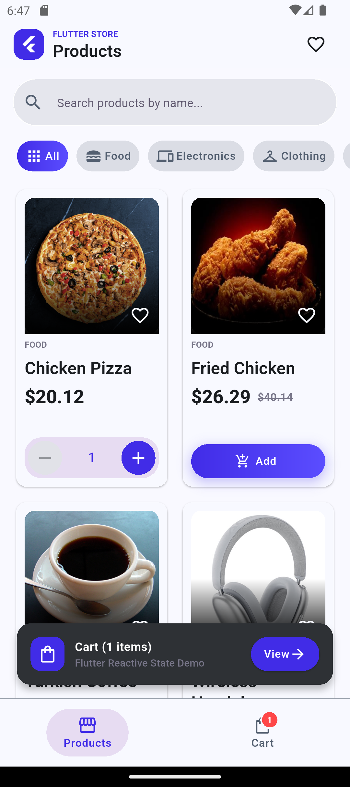
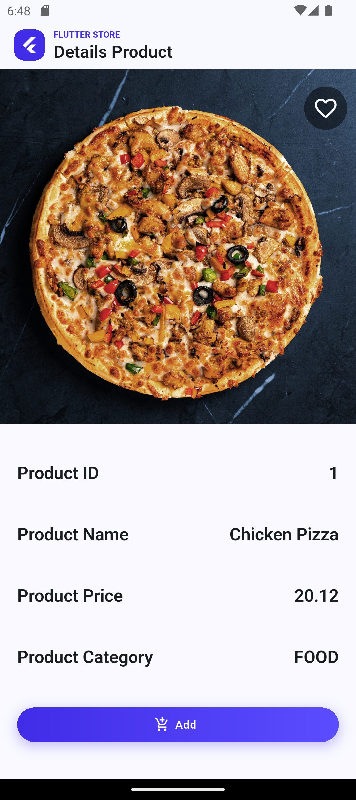
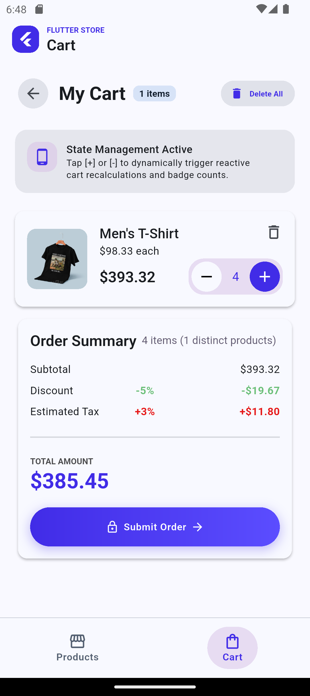
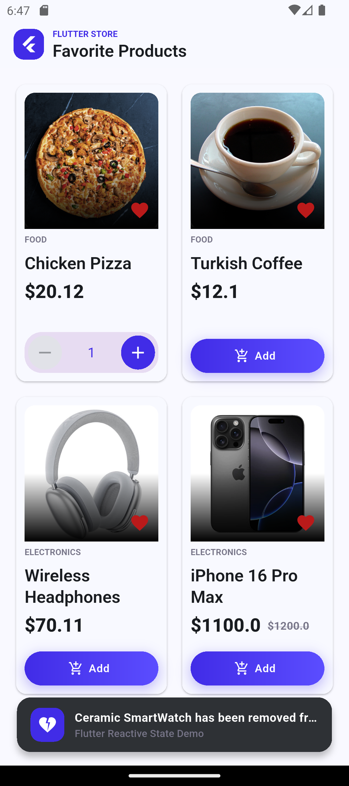

# mini_store

A simple store project built with Flutter for practice and   learning purposes.

##Features

Product listing
Product search
Category filtering
Product details
Shopping cart
Increase and decrease product quantity
Remove products from cart
Discount and tax calculation
Favorite products
SnackBar feedback
Simple button animations

##State Management

This project uses Flutter's built-in state management tools and does not use external state-management packages.

Concepts used:
- setState
- ValueNotifier
- ChangeNotifier
- InheritedNotifier
- Shared application state
- Custom Provider and Scope implementations

## Other Concepts
- Navigation
- Form/UI interactions
- List filtering
- Callbacks
- AnimatedContainer
- Git & GitHub
## Tech Stack
- Flutter
- Dart
# Project Status
Completed as a learning project.
# Note
This project was built to practice Flutter fundamentals and understand state management, UI interactions, and application structure.

## Screenshots

### Home

### Product Details

### Cart

### Favorites
